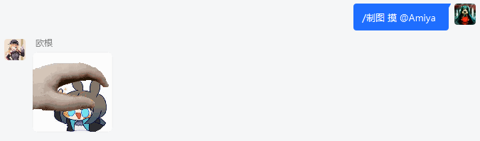
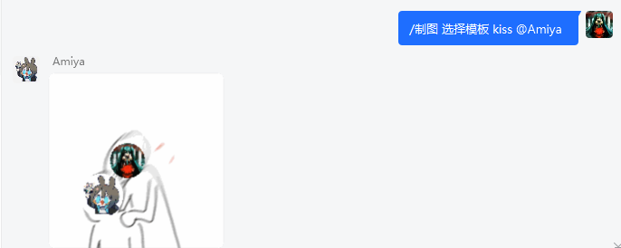

# SimplePetpetPlugin

二次开发[Petpet项目](https://github.com/Dituon/petpet)。使用Petpet的share包里的绘图工具，包装成一个简单的[mirai-console插件](https://github.com/mamoe/mirai/blob/dev/docs/UserManual.md)，作为跨项目使用Petpet的share包的样例。

作为样例，一是为了体现SimplePetpetPlugin和PetpetPlugin可以是有较大差异的两个插件，二是为了让新手开发者更方便理解本项目代码，除了功能更少，还特意采用了如下不同的设计：

- 以Command的方式提供服务，不需自己实现指令匹配
- 通过[SingletonDocumentRepository工具](https://github.com/hundun000/mirai-fleet-framework/blob/main/framework-helper/src/main/java/hundun/miraifleet/framework/helper/repository/SingletonDocumentRepository.java)读取（和写默认值）配置文件。而不是通过JavaAutoSaveConfig读取配置
- 可通过console指令测试制图结果，保存在本地

## 功能说明

使用mirai-console内置的`/help`可看到SimplePetpetPlugin提供的指令：  
```
◆ /制图 选择模板 <模板key> <模板头像位置替换的对象> <(可选)模板文本替换的参数>
  /制图 选择模板 <模板key> <(可选)模板文本替换的参数>
  /制图 测试模板 <模板key> <(可选)模板文本替换的参数>
  /制图 摸 <摸的对象>
```

实际使用效果：  
  


模板位于`data\hundun.mirai.simplepetpet\templates`，其中每一个模板来自[同版本的Petpet项目的](https://github.com/Dituon/petpet/tree/5.1/data/xmmt.dituon.petpet)（当前使用版本：5.1），可从那边复制补充到本项目。

运行`PluginTest`后，即可使用`/制图 测试模板 ……`指令，例如：
> /制图 测试模板 petpet 
>  
> 保存成功：petpet-XXXXXXXXXX.gif  

此处文件保存于`data\hundun.mirai.simplepetpet\save`：  
  

## 其他

本项目主要作为插件开发者参考，开发者可以运行`PluginTest`或自行打包出插件。本项目不提供插件Release。

### 声明：一切开发旨在学习，请勿用于非法用途

- 本项目是完全免费且开放源代码的软件，仅供学习和娱乐用途使用
- 鉴于项目的特殊性，开发团队可能在任何时间**停止更新**或**删除项目**。